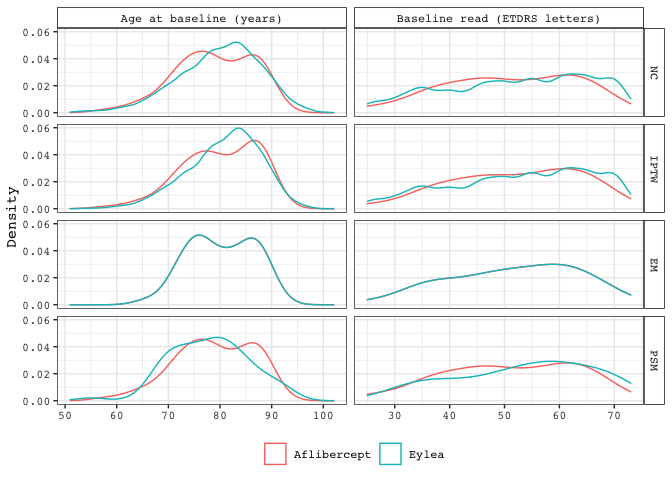

exchangeability
================
Darren S Thomas
29 June, 2020

# read\_data

``` r
# create list of filenames to read from
y <- list(
  "../data/cohort_nc.csv",
  "../data/cohort_iptw.csv",
  "../data/cohort_em.csv",
  "../data/cohort_psm.csv"
)

# read cohorts from .csv
z <- map(
  .x = y,
  ~ read_csv(
    file = .x,
    col_types = cols(
      treatment = col_factor(levels = c('eylea', 'avastin'))
    ))
)

# name each element of list
names(z) <- c('nc', 'iptw', 'em', 'psm')

# add var to identify each cohort when lists are merged
z <- map2(
  .x = z,
  .y = list('nc', 'iptw', 'em', 'psm'),
  ~ mutate(
    .x,
    cohort = .y
  )
)

# add weight var (ipw weights will be updated later)
z <- map(
  .x = z,
  ~ mutate(
    .x,
    weight = 1)
)

# select only cont. confounders
z <- map(
  .x = z,
  ~ select(.x, id, age, baseline_etdrs, cohort, treatment, weight)
)

# combine individual elements into a singl df
zz <- do.call(rbind.data.frame, z)
```

``` r
# pivot longer
zz <- zz %>% 
  pivot_longer(
    cols = age:baseline_etdrs,
    names_to = "var",
    values_to = "unit"
  )
```

``` r
# assign weights for iptw
iptw <- read_csv("../data/cohort_iptw.csv") %>% 
  select(id, treatment, age, baseline_etdrs, weight = ipw) %>% 
  mutate(cohort = "iptw") %>% 
  pivot_longer(
    cols = age:baseline_etdrs,
    names_to = "var",
    values_to = "unit"
  )

zz <- zz %>% 
  filter(cohort != "iptw") %>% 
  bind_rows(iptw)
```

``` r
# assign facet labels to vectors
cohort_lbl <- c(
  "nc" = "NC", 
  "iptw" = "IPTW", 
  "em" = "EM", 
  "psm" = "PSM")

var_lbl <- c(
  "age" = "Age at baseline (years)", 
  "baseline_etdrs" = "Baseline read (ETDRS letters)")

# plot
zz %>% 
  mutate(cohort = factor(cohort, levels = c("nc", "iptw", "em", "psm"))) %>% 
  ggplot(aes(x = unit, colour = treatment, weight = weight)) +
  facet_grid(
    cohort ~ var,
    scales = "free_x",
    labeller = labeller(
      var = var_lbl,
      cohort = cohort_lbl
    )) +
  geom_density(alpha = 0.5) +
  scale_colour_discrete(
    name = NULL,
    labels = c("Aflibercept", "Eylea")) +
  labs(
    x = NULL,
    y = "Density")
```

<!-- -->

``` r
# export as .tiff
ggsave(
  filename = "fig_2.tiff",
  plot = last_plot(),
  device = "tiff",
  path = "../figs",
  width = 178,
  height = 100,
  units = "mm",
  dpi = 300
)
```
