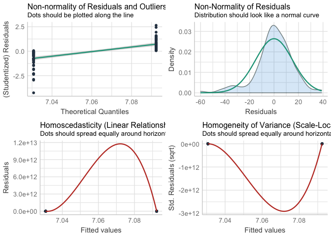

noninferiority
================
Darren S Thomas
13 July, 2020

# read\_data

``` r
# create list of filenames to read from
y <- list(
  "../data/cohort_nc.csv",
  "../data/cohort_iptw.csv",
  "../data/cohort_em.csv",
  "../data/cohort_psm.csv"
)

# read cohorts from .csv
z <- map(
  .x = y,
  ~ read_csv(
    file = .x,
    col_types = cols(
      treatment = col_factor(levels = c('eylea', 'avastin'))
    ))
)

# name each element of list
names(z) <- c('nc', 'iptw', 'em', 'psm')
```

``` r
# impute negative ETDRS

impute_neg_etdrs <- function(x){
    # -4 is in fact etdrs 4 (1/60 snellen meters)
  x$study_exit_va[x$study_exit_va == -4] <- 4
  
  # impute counting fingers (-15 converted ETDRS) to 2
  x$study_exit_va[x$study_exit_va == -15] <- 2
  
  # impute hand motion (-30), light perception (-50), and no light perception (-165) to 0
  x$study_exit_va[x$study_exit_va < 0] <- 0
  
  x
}
```

``` r
mean_change <- function(x){
  
  output <- x %>% 
    mutate(va_change = study_exit_va - baseline_etdrs)
  
  output
}
```

``` r
# apply impute_neg_etdrs & mean_change to each tbl
z <- map(
  .x = z,
  ~ impute_neg_etdrs(x = .x)
  ) 

# apply mean_change to each tbl
z <- map(
  .x = z,
  ~ mean_change(x = .x)
  )
```

``` r
# extract each elelment of list as tbl
nc <- z %>% pluck("nc")

iptw <- z %>% pluck("iptw")
  
em <- z %>% pluck("em")

psm <- z %>% pluck("psm")
```

# outcome\_distributions

``` r
# combine elements of list as tbl
z.tbl <- z %>% 
  bind_rows(.id = "cohort") %>% 
  mutate(ipw = if_else(
    cohort %in% c("em", "nc", "psm"),
    1,
    ipw
  ))
```

``` r
# checkout outcome distirbution
z.tbl %>% 
  ggplot(aes(x = treatment, y = va_change, weight = ipw, colour = treatment)) +
  facet_wrap(~ cohort) +
  geom_violin(draw_quantiles = c(0.25, 0.5, 0.75)) 
```

<!-- -->

``` r
# moderate negative skew
```

``` r
# try out reciprical + constant transformation
z.tbl %>% 
  ggplot(aes(x = treatment, y = 1 / (va_change + 100), weight = ipw, colour = treatment)) +
  facet_wrap(~ cohort) +
  geom_violin(draw_quantiles = c(0.25, 0.5, 0.75))
```

<!-- -->

``` r
# summary mean exit va by treatment and cohort (iptw is NOT weighted)
z.tbl %>% 
  group_by(cohort, treatment) %>% 
  summarise(mean_exit_va = round(mean(study_exit_va), 1))
```

    ## # A tibble: 8 x 3
    ## # Groups:   cohort [4]
    ##   cohort treatment mean_exit_va
    ##   <chr>  <fct>            <dbl>
    ## 1 em     eylea             50.5
    ## 2 em     avastin           56.1
    ## 3 iptw   eylea             55.7
    ## 4 iptw   avastin           58  
    ## 5 nc     eylea             55.9
    ## 6 nc     avastin           58  
    ## 7 psm    eylea             60.4
    ## 8 psm    avastin           58

# nc

``` r
# mean difference
lm(
  va_change ~ 1 + treatment,
  data = nc
) %>% 
  coef()
```

    ##      (Intercept) treatmentavastin 
    ##         3.795007         3.235762

``` r
# two-sided confidence intervals
lm(
  va_change ~ 1 + treatment,
  data = nc
) %>% 
  confint()
```

    ##                       2.5 %   97.5 %
    ## (Intercept)       3.3417776 4.248236
    ## treatmentavastin -0.5063099 6.977835

``` r
# non-parametric
wilcox.test(
  va_change ~ treatment,
  data = nc,
  conf.int = TRUE
)
```

    ## 
    ##  Wilcoxon rank sum test with continuity correction
    ## 
    ## data:  va_change by treatment
    ## W = 119114, p-value = 0.02598
    ## alternative hypothesis: true location shift is not equal to 0
    ## 95 percent confidence interval:
    ##  -7.000052e+00 -1.481671e-05
    ## sample estimates:
    ## difference in location 
    ##              -3.999976

# iptw

``` r
# mean difference
lm(
  va_change ~ 1 + treatment,
  data = iptw,
  weights = ipw
) %>% 
  coef()
```

    ##      (Intercept) treatmentavastin 
    ##         3.388457         3.256231

``` r
# two-sided confidence intervals
lm(
  va_change ~ 1 + treatment,
  data = iptw,
  weights = ipw
) %>% 
  confint()
```

    ##                      2.5 %   97.5 %
    ## (Intercept)       2.923917 3.852997
    ## treatmentavastin -0.534026 7.046488

# em

``` r
# mean difference
lm(
  va_change ~ 1 + treatment,
  data = em
) %>% 
  coef()
```

    ##      (Intercept) treatmentavastin 
    ##        -1.142857         5.642857

``` r
# two-sided confidence intervals
lm(
  sqrt(va_change) ~ 1 + treatment,
  data = em
) %>% 
  confint()
```

    ##                       2.5 %    97.5 %
    ## (Intercept)       2.3471573 3.3309656
    ## treatmentavastin -0.4014669 0.9568479

# psm

``` r
# non-parametric
wilcox.test(
  va_change ~ treatment,
  data = psm,
  conf.int = TRUE
)
```

    ## 
    ##  Wilcoxon rank sum test with continuity correction
    ## 
    ## data:  va_change by treatment
    ## W = 2031.5, p-value = 0.7076
    ## alternative hypothesis: true location shift is not equal to 0
    ## 95 percent confidence interval:
    ##  -5.000043  3.000023
    ## sample estimates:
    ## difference in location 
    ##             -0.9999587

``` r
# mean difference
lm(
  va_change ~ 1 + treatment,
  data = psm
) %>% 
  coef()
```

    ##      (Intercept) treatmentavastin 
    ##       7.09230769      -0.06153846

``` r
# two-sided confidence intervals
lm(
  va_change ~ 1 + treatment,
  data = psm
) %>% 
  confint()
```

    ##                      2.5 %    97.5 %
    ## (Intercept)       3.371573 10.813042
    ## treatmentavastin -5.323452  5.200375

``` r
t.test(
  va_change ~ treatment,
  data = psm
)
```

    ## 
    ##  Welch Two Sample t-test
    ## 
    ## data:  va_change by treatment
    ## t = 0.023141, df = 128, p-value = 0.9816
    ## alternative hypothesis: true difference in means is not equal to 0
    ## 95 percent confidence interval:
    ##  -5.200375  5.323452
    ## sample estimates:
    ##   mean in group eylea mean in group avastin 
    ##              7.092308              7.030769

``` r
lm(
  va_change ~ 1 + treatment,
  data = psm
) %>% 
  performance::check_model()
```

    ## Not enough model terms in the conditional part of the model to check for multicollinearity.

<!-- -->

# forest\_plot

``` r
# values pulled from linear models
ni <- tribble(
  ~ method, ~ mean_difference, ~ lo95, ~ hi95,
  "NC", 3.235762, -0.5063099, 6.977835,
  "IPTW", 3.256231, -0.5063099, 6.977835,
  "EM", 5.642857, -1.995181, 13.280896,
  "PSM", -0.06153846, -5.323452, 5.200375
) %>% 
  mutate(method = factor(method, levels = c("PSM", "EM", "IPTW", "NC")))
```

``` r
# convert to point estimate and confidence intervals to strings (to keep trailing zeros for plot)

to_string <- function(
  var,
  n_digits = 1,
  n_small = 1){
    
  as.character(format(round(var, digits = n_digits), nsmall = n_small))
  
  }
```

``` r
ni <- ni %>% 
  mutate(
    mean_difference_lab = to_string(mean_difference),
    lo95_lab = to_string(lo95),
    hi95_lab = to_string(hi95),
    lab = str_c(
      str_trim(mean_difference_lab), 
      "(", 
      str_trim(lo95_lab), 
      "-", 
      str_trim(hi95_lab), 
      ")")
  )
```

``` r
# forest plot
# set new default ggplot theme
courier_bw <- theme_classic() +
  theme(text = element_text(family = "Courier"),
        legend.position = "bottom",
        axis.text.y = element_text(
          face = "bold", 
          size = 14,
          hjust = 0.5),
        axis.ticks = element_blank(),
        axis.line.y = element_blank())

theme_set(courier_bw)

ni %>% 
  ggplot(aes(x = mean_difference, y = method)) +
  geom_point(
    size = 6,
    shape = 18) +
  labs(
    x = "Mean difference\n(95% Confidence Interval)",
    y = NULL
  ) +
  geom_vline(
    xintercept = -4,
    linetype = "dashed",
    colour = "grey"
  ) +
  geom_errorbarh(aes(
    xmin = lo95,
    xmax = hi95,
    height = 0
  )) +
  geom_text(aes(
    family = 'Courier',
    label = lab),
    parse = FALSE,
    nudge_y = -0.2) +
  scale_x_continuous(breaks = seq(- 6, 14, 2))
```

<!-- -->

``` r
# export as .tiff (half-page fig)
ggsave(
  filename = "fig_2.tiff",
  plot = last_plot(),
  device = "tiff",
  path = "../figs",
  width = 86,
  height = 100,
  units = "mm",
  dpi = 300
)
```

    ## R version 3.6.0 (2019-04-26)
    ## Platform: x86_64-apple-darwin15.6.0 (64-bit)
    ## Running under: macOS Mojave 10.14.6
    ## 
    ## Matrix products: default
    ## BLAS:   /Library/Frameworks/R.framework/Versions/3.6/Resources/lib/libRblas.0.dylib
    ## LAPACK: /Library/Frameworks/R.framework/Versions/3.6/Resources/lib/libRlapack.dylib
    ## 
    ## locale:
    ## [1] en_GB.UTF-8/en_GB.UTF-8/en_GB.UTF-8/C/en_GB.UTF-8/en_GB.UTF-8
    ## 
    ## attached base packages:
    ## [1] stats     graphics  grDevices utils     datasets  methods   base     
    ## 
    ## other attached packages:
    ##  [1] forcats_0.5.0   stringr_1.4.0   dplyr_1.0.0     purrr_0.3.4    
    ##  [5] readr_1.3.1     tidyr_1.1.0     tibble_3.0.2    ggplot2_3.3.2  
    ##  [9] tidyverse_1.3.0 broom_0.5.6    
    ## 
    ## loaded via a namespace (and not attached):
    ##  [1] Rcpp_1.0.4.6      lubridate_1.7.9   lattice_0.20-41   assertthat_0.2.1 
    ##  [5] digest_0.6.25     utf8_1.1.4        R6_2.4.1          cellranger_1.1.0 
    ##  [9] plyr_1.8.6        ggridges_0.5.2    backports_1.1.8   reprex_0.3.0     
    ## [13] evaluate_0.14     httr_1.4.1        pillar_1.4.4      rlang_0.4.6      
    ## [17] readxl_1.3.1      rstudioapi_0.11   see_0.5.0         performance_0.4.6
    ## [21] blob_1.2.1        Matrix_1.2-18     effectsize_0.3.1  rmarkdown_2.2    
    ## [25] splines_3.6.0     labeling_0.3      munsell_0.5.0     compiler_3.6.0   
    ## [29] modelr_0.1.8      xfun_0.14         pkgconfig_2.0.3   parameters_0.7.0 
    ## [33] mgcv_1.8-31       htmltools_0.4.0   insight_0.8.4     tidyselect_1.1.0 
    ## [37] gridExtra_2.3     fansi_0.4.1       crayon_1.3.4      dbplyr_1.4.4     
    ## [41] withr_2.2.0       grid_3.6.0        nlme_3.1-148      jsonlite_1.7.0   
    ## [45] gtable_0.3.0      lifecycle_0.2.0   DBI_1.1.0         magrittr_1.5     
    ## [49] bayestestR_0.6.0  scales_1.1.1      cli_2.0.2         stringi_1.4.6    
    ## [53] farver_2.0.3      fs_1.4.1          xml2_1.3.2        ellipsis_0.3.1   
    ## [57] generics_0.0.2    vctrs_0.3.1       tools_3.6.0       glue_1.4.1       
    ## [61] hms_0.5.3         yaml_2.2.1        colorspace_1.4-1  rvest_0.3.5      
    ## [65] knitr_1.28        haven_2.3.1
