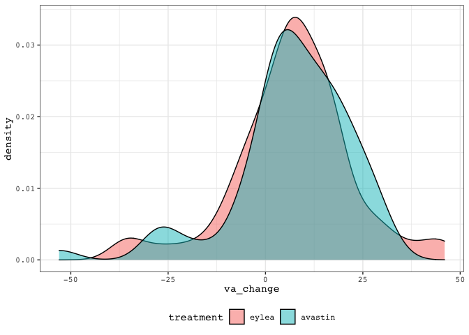

noninferiority
================
Darren S Thomas
06 July, 2020

# read\_data

``` r
# create list of filenames to read from
y <- list(
  "../data/cohort_nc.csv",
  "../data/cohort_iptw.csv",
  "../data/cohort_em.csv",
  "../data/cohort_psm.csv"
)

# read cohorts from .csv
z <- map(
  .x = y,
  ~ read_csv(
    file = .x,
    col_types = cols(
      treatment = col_factor(levels = c('eylea', 'avastin'))
    ))
)

# name each element of list
names(z) <- c('nc', 'iptw', 'em', 'psm')
```

``` r
# impute negative ETDRS

impute_neg_etdrs <- function(x){
    # -4 is in fact etdrs 4 (1/60 snellen meters)
  x$study_exit_va[x$study_exit_va == -4] <- 4
  
  # impute counting fingers (-15 converted ETDRS) to 2
  x$study_exit_va[x$study_exit_va == -15] <- 2
  
  # impute hand motion (-30), light perception (-50), and no light perception (-165) to 0
  x$study_exit_va[x$study_exit_va < 0] <- 0
  
  x
}
```

``` r
mean_change <- function(x){
  
  output <- x %>% 
    mutate(va_change = study_exit_va - baseline_etdrs)
  
  output
}
```

``` r
# apply impute_neg_etdrs & mean_change to each tbl
z <- map(
  .x = z,
  ~ impute_neg_etdrs(x = .x)
  ) 

# apply mean_change to each tbl
z <- map(
  .x = z,
  ~ mean_change(x = .x)
  )
```

``` r
# extract each elelment of list as tbl
nc <- z %>% pluck("nc")

iptw <- z %>% pluck("iptw")
  
em <- z %>% pluck("em")

psm <- z %>% pluck("psm")
```

# nc

``` r
# visualise outcome distirbution
nc %>% 
  ggplot(aes(x = va_change, fill = treatment)) +
    geom_density(alpha = 0.5)
```

<!-- -->

``` r
# mean difference
lm(
  va_change ~ 1 + treatment,
  data = nc
) %>% 
  coef()
```

    ##      (Intercept) treatmentavastin 
    ##         3.795007         3.235762

``` r
# two-sided confidence intervals
lm(
  va_change ~ 1 + treatment,
  data = nc
) %>% 
  confint()
```

    ##                       2.5 %   97.5 %
    ## (Intercept)       3.3417776 4.248236
    ## treatmentavastin -0.5063099 6.977835

# iptw

``` r
# visualise outcome distirbution
iptw %>% 
  ggplot(aes(x = va_change, weight = ipw, fill = treatment)) +
    geom_density(alpha = 0.5)
```

<!-- -->

``` r
# mean difference
lm(
  va_change ~ 1 + treatment,
  data = iptw,
  weights = ipw
) %>% 
  coef()
```

    ##      (Intercept) treatmentavastin 
    ##         3.388457         3.256231

``` r
# two-sided confidence intervals
lm(
  va_change ~ 1 + treatment,
  data = iptw,
  weights = ipw
) %>% 
  confint()
```

    ##                      2.5 %   97.5 %
    ## (Intercept)       2.923917 3.852997
    ## treatmentavastin -0.534026 7.046488

# em

``` r
# visualise outcome distirbution
em %>% 
  ggplot(aes(x = va_change, fill = treatment)) +
    geom_density(alpha = 0.5)
```

<!-- -->

``` r
# mean difference
lm(
  va_change ~ 1 + treatment,
  data = em
) %>% 
  coef()
```

    ##      (Intercept) treatmentavastin 
    ##        -1.142857         5.642857

``` r
# two-sided confidence intervals
lm(
  va_change ~ 1 + treatment,
  data = em
) %>% 
  confint()
```

    ##                      2.5 %    97.5 %
    ## (Intercept)      -6.543766  4.258052
    ## treatmentavastin -1.995181 13.280896

# psm

``` r
# visualise outcome distirbution
psm %>% 
  ggplot(aes(x = va_change, fill = treatment)) +
    geom_density(alpha = 0.5)
```

<!-- -->

``` r
# mean difference
lm(
  va_change ~ 1 + treatment,
  data = psm
) %>% 
  coef()
```

    ##      (Intercept) treatmentavastin 
    ##       7.09230769      -0.06153846

``` r
# two-sided confidence intervals
lm(
  va_change ~ 1 + treatment,
  data = psm
) %>% 
  confint()
```

    ##                      2.5 %    97.5 %
    ## (Intercept)       3.371573 10.813042
    ## treatmentavastin -5.323452  5.200375

# forest\_plot

``` r
# values pulled from linear models
ni <- tribble(
  ~ method, ~ mean_difference, ~ lo95, ~ hi95,
  "NC", 3.235762, -0.5063099, 6.977835,
  "IPTW", 3.256231, -0.5063099, 6.977835,
  "EM", 5.642857, -1.995181, 13.280896,
  "PSM", -0.06153846, -5.323452, 5.200375
) %>% 
  mutate(method = factor(method, levels = c("PSM", "EM", "IPTW", "NC")))
```

``` r
# set default ggplot theme
courier_bw <- theme_classic() +
  theme(text = element_text(family = "Courier"),
        legend.position = "bottom",
        axis.text.y = element_text(
          face = "bold", 
          size = 14,
          hjust = 0.5),
        axis.ticks = element_blank(),
        axis.line.y = element_blank())

theme_set(courier_bw)

ni %>% 
  ggplot(aes(x = mean_difference, y = method)) +
  geom_point(
    size = 6,
    shape = 18) +
  labs(
    x = "Mean difference\n(95% Confidence Interval)",
    y = NULL
  ) +
  geom_vline(
    xintercept = -4,
    linetype = "dashed",
    colour = "grey"
  ) +
  geom_errorbarh(aes(
    xmin = lo95,
    xmax = hi95,
    height = 0
  )) +
  geom_text(aes(
    family = 'Courier',
    label = paste(round(mean_difference, 1), " (", round(lo95, 1), "-", round(hi95, 1), ")",
                  sep = "")),
    parse = TRUE,
    nudge_y = -0.2) +
  scale_x_continuous(breaks = seq(- 6, 14, 2))
```

<!-- -->

``` r
# export as .tiff (half-page fig)
ggsave(
  filename = "fig_2.tiff",
  plot = last_plot(),
  device = "tiff",
  path = "../figs",
  width = 86,
  height = 100,
  units = "mm",
  dpi = 300
)
```

    ## R version 3.6.0 (2019-04-26)
    ## Platform: x86_64-apple-darwin15.6.0 (64-bit)
    ## Running under: macOS Mojave 10.14.6
    ## 
    ## Matrix products: default
    ## BLAS:   /Library/Frameworks/R.framework/Versions/3.6/Resources/lib/libRblas.0.dylib
    ## LAPACK: /Library/Frameworks/R.framework/Versions/3.6/Resources/lib/libRlapack.dylib
    ## 
    ## locale:
    ## [1] en_GB.UTF-8/en_GB.UTF-8/en_GB.UTF-8/C/en_GB.UTF-8/en_GB.UTF-8
    ## 
    ## attached base packages:
    ## [1] stats     graphics  grDevices utils     datasets  methods   base     
    ## 
    ## other attached packages:
    ##  [1] forcats_0.5.0   stringr_1.4.0   dplyr_1.0.0     purrr_0.3.4    
    ##  [5] readr_1.3.1     tidyr_1.1.0     tibble_3.0.1    ggplot2_3.3.1  
    ##  [9] tidyverse_1.3.0 broom_0.5.6    
    ## 
    ## loaded via a namespace (and not attached):
    ##  [1] tidyselect_1.1.0 xfun_0.14        haven_2.3.1      lattice_0.20-41 
    ##  [5] colorspace_1.4-1 vctrs_0.3.1      generics_0.0.2   htmltools_0.4.0 
    ##  [9] yaml_2.2.1       blob_1.2.1       rlang_0.4.6      pillar_1.4.4    
    ## [13] glue_1.4.1       withr_2.2.0      DBI_1.1.0        dbplyr_1.4.4    
    ## [17] modelr_0.1.8     readxl_1.3.1     lifecycle_0.2.0  munsell_0.5.0   
    ## [21] gtable_0.3.0     cellranger_1.1.0 rvest_0.3.5      evaluate_0.14   
    ## [25] labeling_0.3     knitr_1.28       fansi_0.4.1      Rcpp_1.0.4.6    
    ## [29] scales_1.1.1     backports_1.1.7  jsonlite_1.7.0   farver_2.0.3    
    ## [33] fs_1.4.1         hms_0.5.3        digest_0.6.25    stringi_1.4.6   
    ## [37] grid_3.6.0       cli_2.0.2        tools_3.6.0      magrittr_1.5    
    ## [41] crayon_1.3.4     pkgconfig_2.0.3  ellipsis_0.3.1   xml2_1.3.2      
    ## [45] reprex_0.3.0     lubridate_1.7.9  assertthat_0.2.1 rmarkdown_2.2   
    ## [49] httr_1.4.1       rstudioapi_0.11  R6_2.4.1         nlme_3.1-148    
    ## [53] compiler_3.6.0
