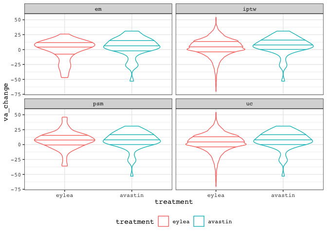
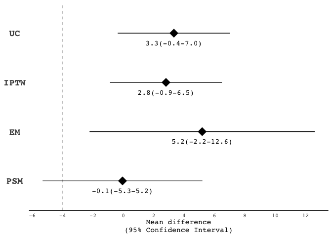

noninferiority
================
Darren S Thomas
05 August, 2020

# read\_data

``` r
# create list of filenames to read from
y <- list(
  "../data/cohort_nc.csv",
  "../data/cohort_iptw.csv",
  "../data/cohort_em.csv",
  "../data/cohort_psm.csv"
)

# read cohorts from .csv
z <- map(
  .x = y,
  ~ read_csv(
    file = .x,
    col_types = cols(
      treatment = col_factor(levels = c('eylea', 'avastin'))
    ))
)

# name each element of list
names(z) <- c('uc', 'iptw', 'em', 'psm')
```

``` r
# impute negative ETDRS

impute_neg_etdrs <- function(x){
    # -4 is in fact etdrs 4 (1/60 snellen meters)
  x$study_exit_va[x$study_exit_va == -4] <- 4
  
  # impute counting fingers (-15 converted ETDRS) to 2
  x$study_exit_va[x$study_exit_va == -15] <- 2
  
  # impute hand motion (-30), light perception (-50), and no light perception (-165) to 0
  x$study_exit_va[x$study_exit_va < 0] <- 0
  
  x
}
```

``` r
mean_change <- function(x){
  
  output <- x %>% 
    mutate(va_change = study_exit_va - baseline_etdrs)
  
  output
}
```

``` r
# apply impute_neg_etdrs & mean_change to each tbl
z <- map(
  .x = z,
  ~ impute_neg_etdrs(x = .x)
  ) 

# apply mean_change to each tbl
z <- map(
  .x = z,
  ~ mean_change(x = .x)
  )
```

``` r
# extract each elelment of list as tbl
uc <- z %>% pluck("uc")

iptw <- z %>% pluck("iptw")
  
em <- z %>% pluck("em")

psm <- z %>% pluck("psm")
```

# outcome\_distributions

``` r
# combine elements of list as tbl
z.tbl <- z %>% 
  bind_rows(.id = "cohort") %>% 
  mutate(ipw = if_else(
    cohort %in% c("em", "uc", "psm"),
    1,
    ipw
  ))
```

``` r
# checkout outcome distirbution
z.tbl %>% 
  ggplot(aes(x = treatment, y = va_change, weight = ipw, colour = treatment)) +
  facet_wrap(~ cohort) +
  geom_violin(draw_quantiles = c(0.25, 0.5, 0.75)) 
```

<!-- -->

``` r
# moderate negative skew
```

``` r
# try out reciprical + constant transformation
z.tbl %>% 
  ggplot(aes(x = treatment, y = 1 / (va_change + 100), weight = ipw, colour = treatment)) +
  facet_wrap(~ cohort) +
  geom_violin(draw_quantiles = c(0.25, 0.5, 0.75))
```

<!-- -->

``` r
# summary mean exit va by treatment and cohort (iptw is NOT weighted)
z.tbl %>% 
  group_by(cohort, treatment) %>% 
  summarise(mean_exit_va = round(mean(study_exit_va), 1))
```

    ## # A tibble: 8 x 3
    ## # Groups:   cohort [4]
    ##   cohort treatment mean_exit_va
    ##   <chr>  <fct>            <dbl>
    ## 1 em     eylea             50.9
    ## 2 em     avastin           56.1
    ## 3 iptw   eylea             56  
    ## 4 iptw   avastin           58  
    ## 5 psm    eylea             60.4
    ## 6 psm    avastin           58  
    ## 7 uc     eylea             55.8
    ## 8 uc     avastin           58

# uc

``` r
# fit lm
uc.lm <- lm(
  va_change ~ 1 + treatment,
  data = uc
) %>% 
  broom::tidy(conf.int = TRUE) %>% 
  mutate(method = "UC")

uc.lm
```

    ## # A tibble: 2 x 8
    ##   term           estimate std.error statistic  p.value conf.low conf.high method
    ##   <chr>             <dbl>     <dbl>     <dbl>    <dbl>    <dbl>     <dbl> <chr> 
    ## 1 (Intercept)        3.71     0.226     16.4  8.95e-59    3.26       4.15 UC    
    ## 2 treatmentavas…     3.32     1.89       1.76 7.82e- 2   -0.376      7.03 UC

# iptw

``` r
# fit lm
iptw.lm <- lm(
  va_change ~ 1 + treatment,
  data = iptw,
  weights = ipw
) %>% 
  broom::tidy(conf.int = TRUE) %>% 
  mutate(method = "IPTW")

iptw.lm
```

    ## # A tibble: 2 x 8
    ##   term           estimate std.error statistic  p.value conf.low conf.high method
    ##   <chr>             <dbl>     <dbl>     <dbl>    <dbl>    <dbl>     <dbl> <chr> 
    ## 1 (Intercept)        3.84     0.232     16.6  6.41e-60    3.39       4.30 IPTW  
    ## 2 treatmentavas…     2.80     1.88       1.49 1.36e- 1   -0.880      6.49 IPTW

# em

``` r
# fit lm
em.lm <- lm(
  va_change ~ 1 + treatment,
  data = em
) %>% 
  broom::tidy(conf.int = TRUE) %>% 
    mutate(method = "EM")

em.lm
```

    ## # A tibble: 2 x 8
    ##   term            estimate std.error statistic p.value conf.low conf.high method
    ##   <chr>              <dbl>     <dbl>     <dbl>   <dbl>    <dbl>     <dbl> <chr> 
    ## 1 (Intercept)       -0.512      2.64    -0.194   0.847    -5.76      4.73 EM    
    ## 2 treatmentavast…    5.19       3.73     1.39    0.168    -2.23     12.6  EM

# psm

``` r
# fit lm
psm.lm <- lm(
  va_change ~ 1 + treatment,
  data = psm
) %>% 
  broom::tidy(conf.int = TRUE) %>% 
  mutate(method = "PSM")

psm.lm
```

    ## # A tibble: 2 x 8
    ##   term            estimate std.error statistic p.value conf.low conf.high method
    ##   <chr>              <dbl>     <dbl>     <dbl>   <dbl>    <dbl>     <dbl> <chr> 
    ## 1 (Intercept)       7.09        1.88    3.77   2.47e-4     3.37     10.8  PSM   
    ## 2 treatmentavast…  -0.0615      2.66   -0.0231 9.82e-1    -5.32      5.20 PSM

# forest\_plot

``` r
# extract estimates from .lm onjects
ni.lm <- bind_rows(
  uc.lm,
  iptw.lm,
  em.lm,
  psm.lm
) %>% 
  rename(
    mean_difference = estimate,
    lo95 = conf.low,
    hi95 = conf.high
  )
```

``` r
# convert to point estimate and confidence intervals to strings (to keep trailing zeros for plot)

to_string <- function(
  var,
  n_digits = 1,
  n_small = 1){
    
  as.character(format(round(var, digits = n_digits), nsmall = n_small))
  
  }
```

``` r
ni.lm <- ni.lm %>% 
  filter(term != "(Intercept)") %>% 
  mutate(
    mean_difference_lab = to_string(mean_difference),
    lo95_lab = to_string(lo95),
    hi95_lab = to_string(hi95),
    lab = str_c(
      str_trim(mean_difference_lab), 
      "(", 
      str_trim(lo95_lab), 
      "-", 
      str_trim(hi95_lab), 
      ")")
  ) %>% 
  mutate(method = factor(method, levels = c("PSM", "EM", "IPTW", "UC")))
```

``` r
# forest plot
# set new default ggplot theme
courier_bw <- theme_classic() +
  theme(text = element_text(family = "Courier"),
        legend.position = "bottom",
        axis.text.y = element_text(
          face = "bold", 
          size = 14,
          hjust = 0.5),
        axis.ticks = element_blank(),
        axis.line.y = element_blank())

theme_set(courier_bw)

ni.lm %>% 
  ggplot(aes(x = mean_difference, y = method)) +
  geom_point(
    size = 6,
    shape = 18) +
  labs(
    x = "Mean difference\n(95% Confidence Interval)",
    y = NULL
  ) +
  geom_vline(
    xintercept = -4,
    linetype = "dashed",
    colour = "grey"
  ) +
  geom_errorbarh(aes(
    xmin = lo95,
    xmax = hi95,
    height = 0
  )) +
  geom_text(aes(
    family = 'Courier',
    label = lab),
    parse = FALSE,
    nudge_y = -0.2) +
  scale_x_continuous(breaks = seq(- 6, 14, 2))
```

<!-- -->

``` r
# export as .tiff (half-page fig)
ggsave(
  filename = "fig_2.tiff",
  plot = last_plot(),
  device = "tiff",
  path = "../figs",
  width = 86,
  height = 86,
  units = "mm",
  dpi = 300
)
```

    ## R version 4.0.2 (2020-06-22)
    ## Platform: x86_64-apple-darwin17.0 (64-bit)
    ## Running under: macOS Mojave 10.14.6
    ## 
    ## Matrix products: default
    ## BLAS:   /Library/Frameworks/R.framework/Versions/4.0/Resources/lib/libRblas.dylib
    ## LAPACK: /Library/Frameworks/R.framework/Versions/4.0/Resources/lib/libRlapack.dylib
    ## 
    ## locale:
    ## [1] en_GB.UTF-8/en_GB.UTF-8/en_GB.UTF-8/C/en_GB.UTF-8/en_GB.UTF-8
    ## 
    ## attached base packages:
    ## [1] stats     graphics  grDevices utils     datasets  methods   base     
    ## 
    ## other attached packages:
    ##  [1] forcats_0.5.0   stringr_1.4.0   dplyr_1.0.0     purrr_0.3.4    
    ##  [5] readr_1.3.1     tidyr_1.1.0     tibble_3.0.3    ggplot2_3.3.2  
    ##  [9] tidyverse_1.3.0 broom_0.7.0    
    ## 
    ## loaded via a namespace (and not attached):
    ##  [1] tidyselect_1.1.0 xfun_0.15        haven_2.3.1      colorspace_1.4-1
    ##  [5] vctrs_0.3.2      generics_0.0.2   htmltools_0.5.0  yaml_2.2.1      
    ##  [9] utf8_1.1.4       blob_1.2.1       rlang_0.4.7      pillar_1.4.6    
    ## [13] glue_1.4.1       withr_2.2.0      DBI_1.1.0        dbplyr_1.4.4    
    ## [17] modelr_0.1.8     readxl_1.3.1     lifecycle_0.2.0  munsell_0.5.0   
    ## [21] gtable_0.3.0     cellranger_1.1.0 rvest_0.3.5      evaluate_0.14   
    ## [25] labeling_0.3     knitr_1.29       fansi_0.4.1      Rcpp_1.0.5      
    ## [29] scales_1.1.1     backports_1.1.8  jsonlite_1.7.0   farver_2.0.3    
    ## [33] fs_1.4.2         hms_0.5.3        digest_0.6.25    stringi_1.4.6   
    ## [37] grid_4.0.2       cli_2.0.2        tools_4.0.2      magrittr_1.5    
    ## [41] crayon_1.3.4     pkgconfig_2.0.3  ellipsis_0.3.1   xml2_1.3.2      
    ## [45] reprex_0.3.0     lubridate_1.7.9  assertthat_0.2.1 rmarkdown_2.3   
    ## [49] httr_1.4.1       rstudioapi_0.11  R6_2.4.1         compiler_4.0.2
