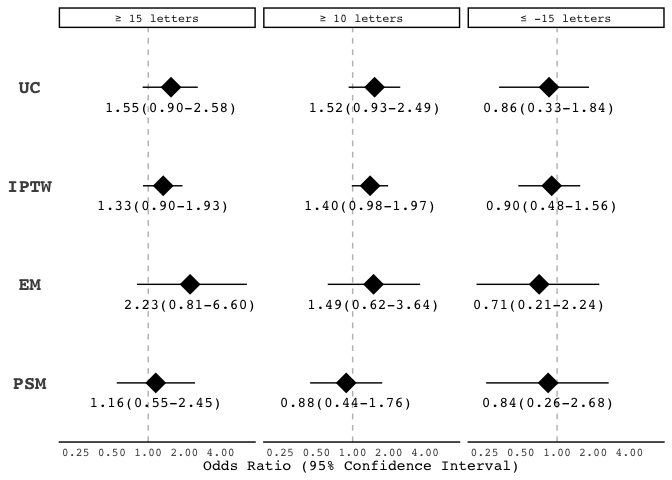

outcome\_regression
================
Darren S Thomas
20 July, 2020

# read\_data

``` r
# create list of filenames to read from
y <- list(
  "../data/cohort_nc.csv",
  "../data/cohort_iptw.csv",
  "../data/cohort_em.csv",
  "../data/cohort_psm.csv"
)

# read cohorts from .csv
z <- map(
  .x = y,
  ~ read_csv(
    file = .x,
    col_types = cols(
      treatment = col_factor(levels = c('eylea', 'avastin'))
    ))
)

# name each element of list
names(z) <- c('uc', 'iptw', 'em', 'psm')

# extract each elelment of list as tbl
uc <- z %>% pluck("uc")

iptw <- z %>% pluck("iptw")
  
em <- z %>% pluck("em")

psm <- z %>% pluck("psm")
```

# source\_fncs

``` r
# source code to pre-process, run, and post-process glm (for em + psm)
source("../fnc/va_glm.R")
```

# uc

``` r
uc <- uc %>% 
  # add null weights
  mutate(weights = 1) %>% 
  va_glm()
```

``` r
# ≥ 15 letters
uc[[6]][[1]]
```

    ## # A tibble: 2 x 7
    ##   term             estimate std.error statistic   p.value conf.low conf.high
    ##   <chr>               <dbl>     <dbl>     <dbl>     <dbl>    <dbl>     <dbl>
    ## 1 (Intercept)         0.318    0.0354    -32.4  6.11e-230    0.297     0.341
    ## 2 treatmentavastin    1.50     0.268       1.51 1.30e-  1    0.871     2.50

``` r
# ≥ 10 letetrs 
uc[[6]][[2]]
```

    ## # A tibble: 2 x 7
    ##   term             estimate std.error statistic  p.value conf.low conf.high
    ##   <chr>               <dbl>     <dbl>     <dbl>    <dbl>    <dbl>     <dbl>
    ## 1 (Intercept)         0.585    0.0314    -17.1  1.30e-65    0.550     0.622
    ## 2 treatmentavastin    1.47     0.251       1.52 1.27e- 1    0.892     2.39

``` r
# > -15 letters
uc[[6]][[3]]
```

    ## # A tibble: 2 x 7
    ##   term             estimate std.error statistic p.value conf.low conf.high
    ##   <chr>               <dbl>     <dbl>     <dbl>   <dbl>    <dbl>     <dbl>
    ## 1 (Intercept)          8.21    0.0486    43.3     0        7.47       9.04
    ## 2 treatmentavastin     1.20    0.431      0.418   0.676    0.558      3.12

``` r
# extract .glm output
uc.glm <- uc %>% 
  select(
    outcome,
    tidy_output
  ) %>% 
  unnest(cols = tidy_output) %>% 
  mutate(method = "UC")

uc.glm
```

    ## # A tibble: 6 x 9
    ## # Groups:   outcome [3]
    ##   outcome term  estimate std.error statistic   p.value conf.low conf.high method
    ##   <chr>   <chr>    <dbl>     <dbl>     <dbl>     <dbl>    <dbl>     <dbl> <chr> 
    ## 1 fiftee… (Int…    0.318    0.0354   -32.4   6.11e-230    0.297     0.341 UC    
    ## 2 fiftee… trea…    1.50     0.268      1.51  1.30e-  1    0.871     2.50  UC    
    ## 3 ten_ga… (Int…    0.585    0.0314   -17.1   1.30e- 65    0.550     0.622 UC    
    ## 4 ten_ga… trea…    1.47     0.251      1.52  1.27e-  1    0.892     2.39  UC    
    ## 5 fiftee… (Int…    8.21     0.0486    43.3   0.           7.47      9.04  UC    
    ## 6 fiftee… trea…    1.20     0.431      0.418 6.76e-  1    0.558     3.12  UC

# iptw

``` r
iptw <- iptw %>% 
  va_glm(weights = iptw$ipw)
```

``` r
# ≥ 15 letters
iptw[[6]][[1]]
```

    ## # A tibble: 2 x 7
    ##   term             estimate std.error statistic p.value conf.low conf.high
    ##   <chr>               <dbl>     <dbl>     <dbl>   <dbl>    <dbl>     <dbl>
    ## 1 (Intercept)         0.304    0.0255    -46.7   0         0.289     0.319
    ## 2 treatmentavastin    1.41     0.192       1.78  0.0755    0.956     2.03

``` r
# ≥ 10 letetrs 
iptw[[6]][[2]]
```

    ## # A tibble: 2 x 7
    ##   term             estimate std.error statistic   p.value conf.low conf.high
    ##   <chr>               <dbl>     <dbl>     <dbl>     <dbl>    <dbl>     <dbl>
    ## 1 (Intercept)         0.561    0.0225    -25.8  3.14e-146    0.537     0.586
    ## 2 treatmentavastin    1.45     0.177       2.10 3.53e-  2    1.02      2.05

``` r
# > -15 letters
iptw[[6]][[3]]
```

    ## # A tibble: 2 x 7
    ##   term             estimate std.error statistic p.value conf.low conf.high
    ##   <chr>               <dbl>     <dbl>     <dbl>   <dbl>    <dbl>     <dbl>
    ## 1 (Intercept)          7.90    0.0341    60.6     0        7.40       8.45
    ## 2 treatmentavastin     1.21    0.300      0.631   0.528    0.699      2.29

``` r
# extract .glm output
iptw.glm <- iptw %>% 
  select(
    outcome,
    tidy_output
  ) %>% 
  unnest(cols = tidy_output) %>% 
  mutate(method = "IPTW")

iptw.glm
```

    ## # A tibble: 6 x 9
    ## # Groups:   outcome [3]
    ##   outcome term  estimate std.error statistic   p.value conf.low conf.high method
    ##   <chr>   <chr>    <dbl>     <dbl>     <dbl>     <dbl>    <dbl>     <dbl> <chr> 
    ## 1 fiftee… (Int…    0.304    0.0255   -46.7   0.           0.289     0.319 IPTW  
    ## 2 fiftee… trea…    1.41     0.192      1.78  7.55e-  2    0.956     2.03  IPTW  
    ## 3 ten_ga… (Int…    0.561    0.0225   -25.8   3.14e-146    0.537     0.586 IPTW  
    ## 4 ten_ga… trea…    1.45     0.177      2.10  3.53e-  2    1.02      2.05  IPTW  
    ## 5 fiftee… (Int…    7.90     0.0341    60.6   0.           7.40      8.45  IPTW  
    ## 6 fiftee… trea…    1.21     0.300      0.631 5.28e-  1    0.699     2.29  IPTW

# em

``` r
em <- em %>% 
  # add null weights
  mutate(weights = 1) %>% 
  va_glm()
```

``` r
# ≥ 15 letters
em[[6]][[1]]
```

    ## # A tibble: 2 x 7
    ##   term             estimate std.error statistic  p.value conf.low conf.high
    ##   <chr>               <dbl>     <dbl>     <dbl>    <dbl>    <dbl>     <dbl>
    ## 1 (Intercept)          0.20     0.414     -3.89 0.000101   0.0814     0.423
    ## 2 treatmentavastin     2.24     0.532      1.52 0.129      0.808      6.66

``` r
# ≥ 10 letetrs 
em[[6]][[2]]
```

    ## # A tibble: 2 x 7
    ##   term             estimate std.error statistic p.value conf.low conf.high
    ##   <chr>               <dbl>     <dbl>     <dbl>   <dbl>    <dbl>     <dbl>
    ## 1 (Intercept)          0.5      0.327    -2.12   0.0342    0.256     0.933
    ## 2 treatmentavastin     1.36     0.454     0.678  0.498     0.560     3.35

``` r
# > -15 letters
em[[6]][[3]]
```

    ## # A tibble: 2 x 7
    ##   term             estimate std.error statistic  p.value conf.low conf.high
    ##   <chr>               <dbl>     <dbl>     <dbl>    <dbl>    <dbl>     <dbl>
    ## 1 (Intercept)          3.67     0.376     3.46  0.000550    1.83       8.15
    ## 2 treatmentavastin     1.64     0.580     0.850 0.395       0.532      5.35

``` r
# extract .glm output
em.glm <- em %>% 
  select(
    outcome,
    tidy_output
  ) %>% 
  unnest(cols = tidy_output) %>% 
  mutate(method = "EM")

em.glm
```

    ## # A tibble: 6 x 9
    ## # Groups:   outcome [3]
    ##   outcome  term   estimate std.error statistic p.value conf.low conf.high method
    ##   <chr>    <chr>     <dbl>     <dbl>     <dbl>   <dbl>    <dbl>     <dbl> <chr> 
    ## 1 fifteen… (Inte…     0.20     0.414    -3.89  1.01e-4   0.0814     0.423 EM    
    ## 2 fifteen… treat…     2.24     0.532     1.52  1.29e-1   0.808      6.66  EM    
    ## 3 ten_gain (Inte…     0.5      0.327    -2.12  3.42e-2   0.256      0.933 EM    
    ## 4 ten_gain treat…     1.36     0.454     0.678 4.98e-1   0.560      3.35  EM    
    ## 5 fifteen… (Inte…     3.67     0.376     3.46  5.50e-4   1.83       8.15  EM    
    ## 6 fifteen… treat…     1.64     0.580     0.850 3.95e-1   0.532      5.35  EM

# psm

``` r
psm <- psm %>% 
  # add null weights
  mutate(weights = 1) %>% 
  va_glm()
```

``` r
# ≥ 15 letters
psm[[6]][[1]]
```

    ## # A tibble: 2 x 7
    ##   term             estimate std.error statistic p.value conf.low conf.high
    ##   <chr>               <dbl>     <dbl>     <dbl>   <dbl>    <dbl>     <dbl>
    ## 1 (Intercept)         0.477     0.265 -2.79e+ 0 0.00529    0.278     0.792
    ## 2 treatmentavastin    1.00      0.375 -2.22e-15 1.00       0.478     2.09

``` r
# ≥ 10 letters 
psm[[6]][[2]]
```

    ## # A tibble: 2 x 7
    ##   term             estimate std.error statistic p.value conf.low conf.high
    ##   <chr>               <dbl>     <dbl>     <dbl>   <dbl>    <dbl>     <dbl>
    ## 1 (Intercept)         0.711     0.252    -1.36    0.175    0.430      1.16
    ## 2 treatmentavastin    1.21      0.354     0.530   0.596    0.603      2.42

``` r
# > -15 letters
psm[[6]][[3]]
```

    ## # A tibble: 2 x 7
    ##   term             estimate std.error statistic     p.value conf.low conf.high
    ##   <chr>               <dbl>     <dbl>     <dbl>       <dbl>    <dbl>     <dbl>
    ## 1 (Intercept)        15.2       0.516     5.28  0.000000130    6.29      50.2 
    ## 2 treatmentavastin    0.645     0.671    -0.654 0.513          0.158      2.37

``` r
# extract .glm output
psm.glm <- psm %>% 
  select(
    outcome,
    tidy_output
  ) %>% 
  unnest(cols = tidy_output)%>% 
  mutate(method = "PSM")

psm.glm
```

    ## # A tibble: 6 x 9
    ## # Groups:   outcome [3]
    ##   outcome  term   estimate std.error statistic p.value conf.low conf.high method
    ##   <chr>    <chr>     <dbl>     <dbl>     <dbl>   <dbl>    <dbl>     <dbl> <chr> 
    ## 1 fifteen… (Inte…    0.477     0.265 -2.79e+ 0 5.29e-3    0.278     0.792 PSM   
    ## 2 fifteen… treat…    1.00      0.375 -2.22e-15 1.00e+0    0.478     2.09  PSM   
    ## 3 ten_gain (Inte…    0.711     0.252 -1.36e+ 0 1.75e-1    0.430     1.16  PSM   
    ## 4 ten_gain treat…    1.21      0.354  5.30e- 1 5.96e-1    0.603     2.42  PSM   
    ## 5 fifteen… (Inte…   15.2       0.516  5.28e+ 0 1.30e-7    6.29     50.2   PSM   
    ## 6 fifteen… treat…    0.645     0.671 -6.54e- 1 5.13e-1    0.158     2.37  PSM

# forest\_plot

``` r
# bind .glm outputs
sup <- bind_rows(
  uc.glm,
  iptw.glm,
  em.glm,
  psm.glm
) %>% 
  # rename broom::tidy() outputs
  rename(
    or = estimate,
    lo95 = conf.low,
    hi95 = conf.high
  ) %>% 
  # 
  mutate(outcome = case_when(
    outcome == "fifteen_gain" ~ "≥ 15 letters",
    outcome == "ten_gain" ~ "≥ 10 letters",
    outcome == "fifteen_loss" ~ "> -15 letters"
  ))
```

``` r
# convert to point estimate and confidence intervals to strings (to keep trailing zeros for plot)

to_string <- function(
  var,
  n_digits = 2,
  n_small = 2){
    
  as.character(format(round(var, digits = n_digits), nsmall = n_small))
  
  }
```

``` r
sup <- sup %>% 
  mutate(
    or_lab = to_string(or),
    lo95_lab = to_string(lo95),
    hi95_lab = to_string(hi95),
    lab = str_c(
      str_trim(or_lab),
      "(",
      str_trim(lo95_lab),
      "-",
      str_trim(hi95_lab),
      ")"
    )
  )
```

``` r
# plot, faceted by adjustment
sup %>% 
  filter(term != "(Intercept)") %>% 
  mutate(
    method = factor(method, levels = c("PSM", "EM", "IPTW", "UC")),
    outcome = factor(outcome, levels = c('≥ 15 letters', '≥ 10 letters', '> -15 letters'))) %>% 
ggplot(aes(x = or, y = method)) +
  facet_grid(.~outcome) +
  # log scale
  scale_x_log10(breaks = c(0.25, 0.5, 1, 2, 4)) +
  # add line of no effect
  geom_vline(
    xintercept = 1,
    linetype = "dashed",
    colour = 'grey'
  ) +
  # add confidence intervals
  geom_errorbarh(aes(
    xmin = lo95,
    xmax = hi95,
    height = 0
  )) +
  # add point estimates
  geom_point(
    size = 7,
    shape = 18) +
  # add text for point estimates and confidence intervals
  geom_text(aes(
    family = 'Courier',
    label = lab),
    parse = FALSE,
    nudge_y = -0.2) +
  # ammend visuals
  labs(
    x = "Odds Ratio (95% Confidence Interval)",
    y = NULL) +
  theme(legend.position = "none")
```

<!-- -->

``` r
# export as .tiff
ggsave(
  filename = "fig_3.tiff",
  plot = last_plot(),
  device = "tiff",
  path = "../figs",
  width = 178,
  height = 100,
  units = "mm",
  dpi = 300
)
```

    ## R version 4.0.2 (2020-06-22)
    ## Platform: x86_64-apple-darwin17.0 (64-bit)
    ## Running under: macOS Mojave 10.14.6
    ## 
    ## Matrix products: default
    ## BLAS:   /Library/Frameworks/R.framework/Versions/4.0/Resources/lib/libRblas.dylib
    ## LAPACK: /Library/Frameworks/R.framework/Versions/4.0/Resources/lib/libRlapack.dylib
    ## 
    ## locale:
    ## [1] en_GB.UTF-8/en_GB.UTF-8/en_GB.UTF-8/C/en_GB.UTF-8/en_GB.UTF-8
    ## 
    ## attached base packages:
    ## [1] stats     graphics  grDevices utils     datasets  methods   base     
    ## 
    ## other attached packages:
    ##  [1] forcats_0.5.0   stringr_1.4.0   dplyr_1.0.0     purrr_0.3.4    
    ##  [5] readr_1.3.1     tidyr_1.1.0     tibble_3.0.3    ggplot2_3.3.2  
    ##  [9] tidyverse_1.3.0 broom_0.7.0    
    ## 
    ## loaded via a namespace (and not attached):
    ##  [1] tidyselect_1.1.0 xfun_0.15        haven_2.3.1      colorspace_1.4-1
    ##  [5] vctrs_0.3.2      generics_0.0.2   htmltools_0.5.0  yaml_2.2.1      
    ##  [9] utf8_1.1.4       blob_1.2.1       rlang_0.4.7      pillar_1.4.6    
    ## [13] glue_1.4.1       withr_2.2.0      DBI_1.1.0        dbplyr_1.4.4    
    ## [17] modelr_0.1.8     readxl_1.3.1     lifecycle_0.2.0  munsell_0.5.0   
    ## [21] gtable_0.3.0     cellranger_1.1.0 rvest_0.3.5      evaluate_0.14   
    ## [25] knitr_1.29       fansi_0.4.1      Rcpp_1.0.5       scales_1.1.1    
    ## [29] backports_1.1.8  jsonlite_1.7.0   farver_2.0.3     fs_1.4.2        
    ## [33] hms_0.5.3        digest_0.6.25    stringi_1.4.6    grid_4.0.2      
    ## [37] cli_2.0.2        tools_4.0.2      magrittr_1.5     crayon_1.3.4    
    ## [41] pkgconfig_2.0.3  ellipsis_0.3.1   MASS_7.3-51.6    xml2_1.3.2      
    ## [45] reprex_0.3.0     lubridate_1.7.9  assertthat_0.2.1 rmarkdown_2.3   
    ## [49] httr_1.4.1       rstudioapi_0.11  R6_2.4.1         compiler_4.0.2
