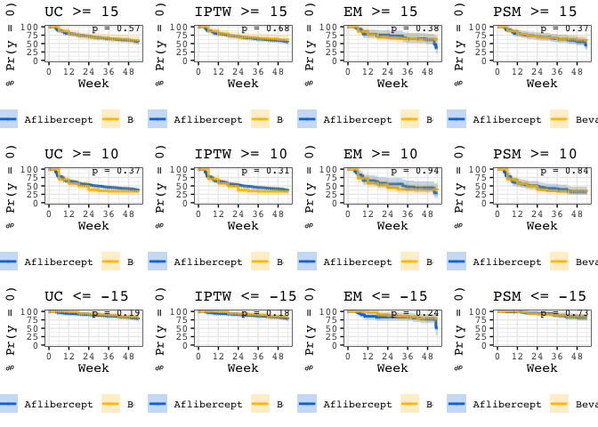

1\_survival\_analysis
================
Darren S Thomas
07 September, 2020

# read data

``` sql
SELECT *
FROM syn_avastin_eylea_censorship;
```

``` r
# convert sql import to tbl
censorship <- as_tibble(censorship)
```

``` r
# create list of filenames to read from
y <- list(
  "../data/cohort_nc.csv",
  "../data/cohort_iptw.csv",
  "../data/cohort_em.csv",
  "../data/cohort_psm.csv"
)

# read cohorts from .csv
z <- map(
  .x = y,
  ~ read_csv(
    file = .x,
    col_types = cols(
      treatment = col_factor(levels = c('eylea', 'avastin'))
    ))
)

# name each element of list
names(z) <- c('nc', 'iptw', 'em', 'psm')

# extract each elelment of list as tbl
nc <- z %>% pluck('nc')

iptw <- z %>% pluck('iptw')
  
em <- z %>% pluck('em')

psm <- z %>% pluck('psm')
```

``` r
# Surv requires weights

nc <- mutate(nc, weights = 1)
iptw <- rename(iptw, weights = ipw)
em <- mutate(em, weights = 1)
psm <- mutate(psm, weights = 1)
```

``` r
# source fncs
source("../fnc/survival_wrangle.R")   # joins censorship data to cohorts
source("../fnc/survival_km.R")        # models a survfit object
source("../fnc/ggsurvplot_courier.R") # plots kaplan-meiers
```

# nc

``` r
#

nc.cens <- map2(
  .x = list(
    nc
  ),
  .y = list(
    '>=15',
    '>=10',
    '<=-15'),
  .f = ~ survival_wrangle(
    cohort_tbl = .x,
    pool_tbl = censorship,
    event = .y
  )
)

names(nc.cens) <- list(
    '>= 15',
    '>= 10',
    '<= -15')
```

``` r
#

nc.kms <- map(
  .x = nc.cens,
  ~ survival_km(
    data = .x,
    weights = weights
  )
)
```

``` r
# 

nc.plots <- pmap(
  list(
    nc.kms,
    nc.cens,
    names(nc.kms)),
  ~ ggsurvplot_courier(
      fit = ..1,
      data = ..2,
      title = str_c("UC ", ..3)
    )
  )
```

# iptw

``` r
#

iptw.cens <- map2(
  .x = list(
    iptw
  ),
  .y = list(
    '>=15',
    '>=10',
    '<=-15'),
  .f = ~ survival_wrangle(
    cohort_tbl = .x,
    pool_tbl = censorship,
    event = .y
  )
)

names(iptw.cens) <- list(
    '>= 15',
    '>= 10',
    '<= -15')
```

``` r
#

iptw.kms <- map(
  .x = iptw.cens,
  ~ survival_km(
    data = .x,
    weights = weights
  )
)
```

``` r
#

iptw.plots <- pmap(
  list(
    iptw.kms,
    iptw.cens,
    names(iptw.kms)),
  ~ ggsurvplot_courier(
      fit = ..1,
      data = ..2,
      title = str_c("IPTW ", ..3)
    )
  )
```

# em

``` r
#

em.cens <- map2(
  .x = list(
    em
  ),
  .y = list(
    '>=15',
    '>=10',
    '<=-15'),
  .f = ~ survival_wrangle(
    cohort_tbl = .x,
    pool_tbl = censorship,
    event = .y
  )
)

names(em.cens) <- list(
    '>= 15',
    '>= 10',
    '<= -15')
```

``` r
#

em.kms <- map(
  .x = em.cens,
  ~ survival_km(
    data = .x,
    weights = weights
  )
)
```

``` r
#

em.plots <- pmap(
  list(
    em.kms,
    em.cens,
    names(em.kms)),
  ~ ggsurvplot_courier(
      fit = ..1,
      data = ..2,
      title = str_c("EM ", ..3)
    )
  )
```

# psm

``` r
#

psm.cens <- map2(
  .x = list(
    psm
  ),
  .y = list(
    '>=15',
    '>=10',
    '<=-15'),
  .f = ~ survival_wrangle(
    cohort_tbl = .x,
    pool_tbl = censorship,
    event = .y
  )
)

names(psm.cens) <- list(
    '>= 15',
    '>= 10',
    '<= -15')
```

``` r
#

psm.kms <- map(
  .x = psm.cens,
  ~ survival_km(
    data = .x,
    weights = weights
  )
)
```

``` r
#

psm.plots <- pmap(
  list(
    psm.kms,
    psm.cens,
    names(psm.kms)),
  ~ ggsurvplot_courier(
      fit = ..1,
      data = ..2,
      title = str_c("PSM ", ..3)
    )
  )
```

# combine plots

Using `survminer::arrange()` would be the obvious choice, but this way
does not allow for a common legend:

``` r
plots <- c(
  nc.plots,
  iptw.plots,
  em.plots,
  psm.plots
)

arrange_ggsurvplots( 
  plots, 
  print = TRUE,
  ncol = 4,
  nrow = 3)
```

<!-- -->

Thus, a slight convoluted approach is taking using pathwork, which
requires the $plot obejct to be extracted from each ggsurvplot object.

``` r
# extract plot from each ggsurvplot

nc.a <- nc.plots[[">= 15"]][["plot"]]
nc.b <- nc.plots[[">= 10"]][["plot"]]
nc.c <- nc.plots[["<= -15"]][["plot"]]

iptw.a <- iptw.plots[[">= 15"]][["plot"]]
iptw.b <- iptw.plots[[">= 10"]][["plot"]]
iptw.c <- iptw.plots[["<= -15"]][["plot"]]

em.a <- em.plots[[">= 15"]][["plot"]]
em.b <- em.plots[[">= 10"]][["plot"]]
em.c <- em.plots[["<= -15"]][["plot"]]

psm.a <- psm.plots[[">= 15"]][["plot"]]
psm.b <- psm.plots[[">= 10"]][["plot"]]
psm.c <- psm.plots[["<= -15"]][["plot"]]
```

``` r
(nc.a + iptw.a + em.a + psm.a + nc.b + iptw.b + em.b + psm.b + nc.c + iptw.c + em.c + psm.c)  +
  plot_layout(guides = "collect")
```

<!-- -->

``` r
# export as .tiff
ggsave(
  filename = "fig_4.tiff",
  plot = last_plot(),
  device = "tiff",
  path = "../figs",
  width = 178,
  height = 120,
  units = "mm",
  dpi = 300
)
```

    ## R version 4.0.2 (2020-06-22)
    ## Platform: x86_64-apple-darwin17.0 (64-bit)
    ## Running under: macOS Mojave 10.14.6
    ## 
    ## Matrix products: default
    ## BLAS:   /Library/Frameworks/R.framework/Versions/4.0/Resources/lib/libRblas.dylib
    ## LAPACK: /Library/Frameworks/R.framework/Versions/4.0/Resources/lib/libRlapack.dylib
    ## 
    ## locale:
    ## [1] en_GB.UTF-8/en_GB.UTF-8/en_GB.UTF-8/C/en_GB.UTF-8/en_GB.UTF-8
    ## 
    ## attached base packages:
    ## [1] stats     graphics  grDevices utils     datasets  methods   base     
    ## 
    ## other attached packages:
    ##  [1] keyring_1.1.0   forcats_0.5.0   stringr_1.4.0   dplyr_1.0.0    
    ##  [5] purrr_0.3.4     readr_1.3.1     tidyr_1.1.0     tibble_3.0.3   
    ##  [9] tidyverse_1.3.0 survminer_0.4.8 ggpubr_0.4.0    ggplot2_3.3.2  
    ## [13] survival_3.2-3  patchwork_1.0.1
    ## 
    ## loaded via a namespace (and not attached):
    ##  [1] httr_1.4.2        RMySQL_0.10.20    jsonlite_1.7.0    splines_4.0.2    
    ##  [5] carData_3.0-4     modelr_0.1.8      assertthat_0.2.1  blob_1.2.1       
    ##  [9] cellranger_1.1.0  yaml_2.2.1        pillar_1.4.6      backports_1.1.9  
    ## [13] lattice_0.20-41   glue_1.4.2        digest_0.6.25     ggsignif_0.6.0   
    ## [17] rvest_0.3.5       colorspace_1.4-1  htmltools_0.5.0   Matrix_1.2-18    
    ## [21] pkgconfig_2.0.3   broom_0.7.0       haven_2.3.1       xtable_1.8-4     
    ## [25] scales_1.1.1      km.ci_0.5-2       openxlsx_4.1.5    rio_0.5.16       
    ## [29] KMsurv_0.1-5      farver_2.0.3      generics_0.0.2    car_3.0-8        
    ## [33] ellipsis_0.3.1    withr_2.2.0       cli_2.0.2         magrittr_1.5     
    ## [37] crayon_1.3.4      readxl_1.3.1      evaluate_0.14     fs_1.5.0         
    ## [41] fansi_0.4.1       rstatix_0.6.0     xml2_1.3.2        foreign_0.8-80   
    ## [45] tools_4.0.2       data.table_1.13.0 hms_0.5.3         lifecycle_0.2.0  
    ## [49] munsell_0.5.0     reprex_0.3.0      zip_2.0.4         compiler_4.0.2   
    ## [53] rlang_0.4.7       grid_4.0.2        rstudioapi_0.11   labeling_0.3     
    ## [57] rmarkdown_2.3     gtable_0.3.0      abind_1.4-5       DBI_1.1.0        
    ## [61] curl_4.3          R6_2.4.1          gridExtra_2.3     zoo_1.8-8        
    ## [65] lubridate_1.7.9   knitr_1.29        survMisc_0.5.5    stringi_1.4.6    
    ## [69] Rcpp_1.0.5        vctrs_0.3.4       dbplyr_1.4.4      tidyselect_1.1.0 
    ## [73] xfun_0.15
