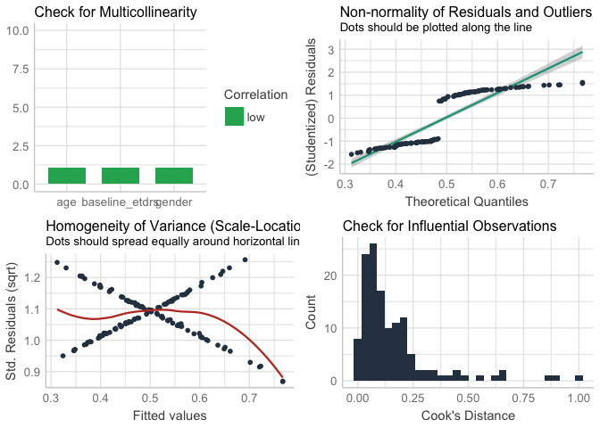
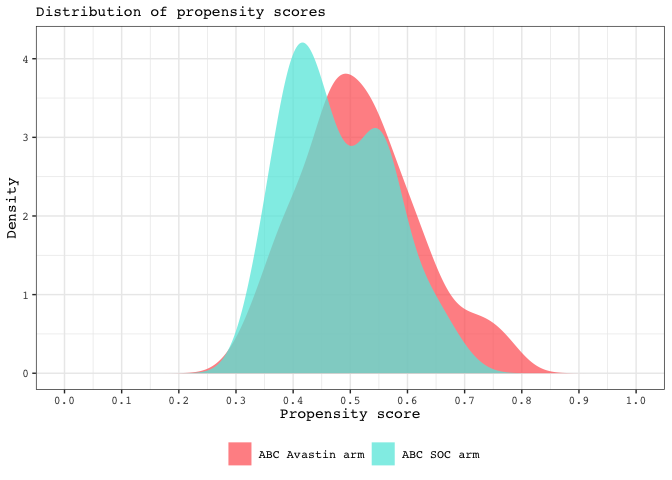

2020\_propensity\_model\_diagnostics
================
Darren S Thomas
03 April, 2020

# setup

``` r
# source propensity model
source("src/propensity_model.R")
```

``` r
# check model asusmptions
performance::check_model(propensity_model)
```

<!-- -->

``` r
# preview equation as LaTeX formula
equatiomatic::extract_eq(propensity_model,
                         use_coefs = TRUE,
                         wrap = TRUE,
                         terms_per_line = 3,
                         operator_location = "start") %>% 
  equatiomatic::preview()
# TO DO: AUTOMATIC SAVE OF IMAGE TO /FIGURES OR EXORT AS LATEX FORMULA.
```

``` r
# print augment() distributions
abc.augmented <- broom::augment(propensity_model,
                                data = abc.all,
                                type.predict = "response") %>% 
  # coerce avastin to factor or plotting
  mutate(avastin = factor(avastin,
                          levels = c(1, 0)))
```

``` r
# plot as density distributions
ggplot(abc.augmented, 
       aes(x = .fitted, fill = avastin)) +
geom_density(alpha = 0.75, 
             size = 0) +
labs(subtitle = "Distribution of propensity scores",
     x = "Propensity score",
     y = "Density") +
scale_fill_manual(values = c("#FF6B6B", "#63E8DF"),
                  name = NULL,
                  labels = c("ABC Avastin arm", "ABC SOC arm")) +
scale_x_continuous(breaks = seq(0, 1, 0.1),
                   limits = c(0, 1))
```

<!-- -->
\`\`\`

``` r
# export to /figs
```
