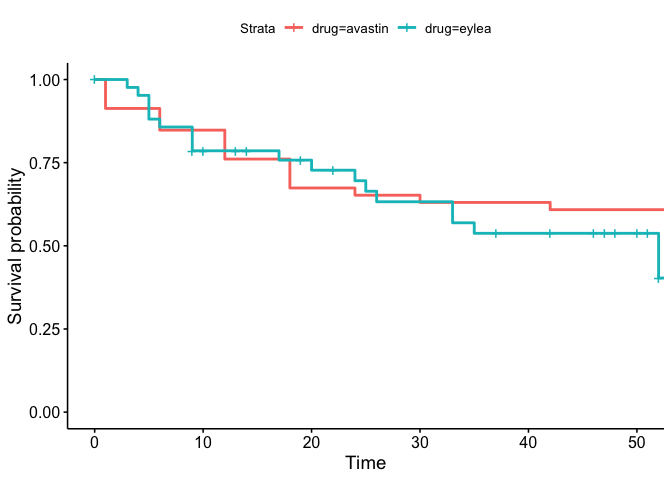
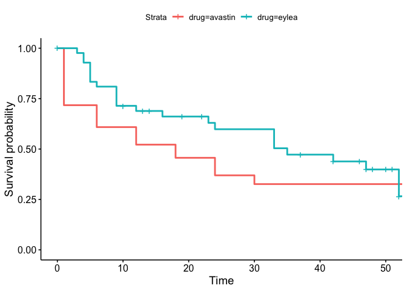
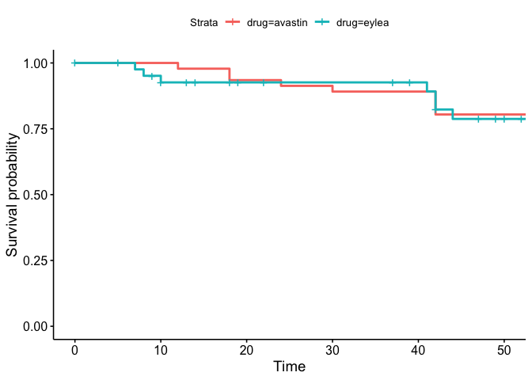

exact\_matching\_eylea
================
Darren S Thomas
25 February, 2020

# Setup

Script to for time-to-event analysis. Requires
`src/synthetic_eylea_exact_survival.sql` to be run beforehand.

Load frequently used packages.

``` r
library(survival)
library(tidyverse)
```

Set new default ggplot theme.

``` r
courier_bw <- theme_bw() +
  theme(text = element_text(family = "Courier"),
        legend.position = "bottom")

theme_set(courier_bw)
```

# Import from kale

Setup mysql connection.

``` r
kale <- DBI::dbConnect(RMySQL::MySQL(),
                        user = "admin", 
                        password = "password",
                        dbname = "NOVA6",
                        host = "127.0.0.1",
                        port = 9999)
```

Export table into r.

``` sql
SELECT *
FROM synthetic_eylea_exact_survival;
```

Convert to tibble and then nest.

``` r
eylea.exact.survival <- eylea.exact.survival %>% 
  as.tibble() %>% 
  group_by(event) %>% 
  nest() 
```

Model Kaplan-Meier for each event analysis.

``` r
eylea.exact.survival <- eylea.exact.survival %>% 
  mutate(km_models = map(
    .x = data,
    ~ survfit(Surv(time = week_exit,
                   event = outcome) ~ drug,
              data = .x)
  ))
```

ggsurvplot

``` r
eylea.exact.survival <- eylea.exact.survival %>% 
  mutate(
    plotz = 
      map2(.x = km_models,
           .y = data,
           ~ survminer::ggsurvplot(
             fit = .x,
             data = .y
           )))
```

``` r
walk(eylea.exact.survival[["plotz"]], print)
```

<!-- --><!-- --><!-- -->
