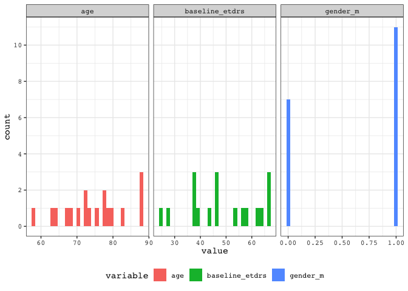

exact\_matching\_eylea
================
Darren S Thomas
24 February, 2020

# Setup

Script to for exact matching of ABC .

Output tables export to kale are:

  - matched.va as \[eylea\_exact\_va\_long\]
  - matched.pairs.long as \[eylea\_exact\_pairs\_long\]

Load frequently used packages.

``` r
library(tidyverse)
```

Set new default ggplot theme.

``` r
courier_bw <- theme_bw() +
  theme(text = element_text(family = "Courier"),
        legend.position = "bottom")

theme_set(courier_bw)
```

Read abc data.

``` r
abc <- read_csv("data/abc_patient_characteristics.csv",
                    col_types = cols(
                      injection_count = col_skip(),
                      id = col_factor(),
                      injection_count = col_integer(),
                      age_at_baseline = col_integer(),
                      baseline_etdrs = col_integer())) %>% 
  mutate(gender_m = if_else(gender == "M", 1, 0)) %>% 
  filter(treatment == "avastin") %>% 
  rename(
    age = age_at_baseline) %>% 
  unite(col = "age_gender_etdrs", 
        c("age", "gender", "baseline_etdrs"), 
        sep = "-",
        remove = FALSE) %>% 
  select(id,
         age_gender_etdrs, 
         gender_m,
         age, 
         baseline_etdrs)
```

Read ehr data.

``` r
kale <- DBI::dbConnect(RMySQL::MySQL(),
                        user = "admin", 
                        password = "password",
                        dbname = "NOVA6",
                        host = "127.0.0.1",
                        port = 9999)
```

Import pool of potential synthtic controls from kale.

``` sql
SELECT patient_eye AS id,
       injection_count,
       gender,
       age_at_baseline AS age,
       baseline_va AS baseline_etdrs
FROM amd_synthetic_eylea_arm_study_table   
WHERE eligibility = 1;
```

Convert gender to a dummy variable.

``` r
ehr <- ehr %>% 
  mutate(
    gender_m = if_else(gender == "M", 1, 0)) %>% 
  select(id,
         gender_m,
         age,
         baseline_etdrs)
```

Convert to list-column workflow

``` r
abc.nest <- abc %>% 
  group_by(id, age_gender_etdrs) %>% 
  nest()
```

Create a new list column with all exact matched.

``` r
abc.nest <- abc.nest %>% 
  mutate(matches = map(.x = data, 
                       ~ left_join(.x,
                                   ehr,
                                   by = c("gender_m",
                                          "age",
                                          "baseline_etdrs"),
                                   keep = TRUE)))
```

Randomly sample 1 control for each ABC subject.

``` r
set.seed(1337)

abc.nest <- abc.nest %>% 
  mutate(sampled_control = map(.x = matches,
                               ~ sample_n(.x, size = 1)))
```

Unnest list column.

``` r
abc.unnest <- abc.nest %>% 
  select(sampled_control) %>% 
  unnest() %>% 
  ungroup() %>% 
  rename(
    abc_id = id,
    ehr_id = id1)
```

Create look-up table for matched pairs.

``` r
matched.pairs <- abc.unnest %>% 
  drop_na(ehr_id) %>% 
  select(age_gender_etdrs,
         abc_id,
         ehr_id) %>% 
  # add pair_id
  mutate(pair_id = 1:46)

# create the same table in long form
matched.pairs.long <- matched.pairs %>% 
  pivot_longer(cols = abc_id: ehr_id,
               names_to = "cohort",
               values_to = "id")
```

Forty-six of 64 (0.72) eyes had exact matches. The 18 subjects that had
no exact matches were:

``` r
abc.unnest %>%
  filter(is.na(ehr_id)) %>% 
  select(abc_id,
         age_gender_etdrs)
```

    ## # A tibble: 18 x 2
    ##    abc_id age_gender_etdrs
    ##    <fct>  <chr>           
    ##  1 5      68-M-53         
    ##  2 9      88-F-38         
    ##  3 11     79-M-67         
    ##  4 20     80-M-56         
    ##  5 24     83-M-38         
    ##  6 33     73-M-47         
    ##  7 39     78-M-47         
    ##  8 52     72-F-28         
    ##  9 57     72-F-44         
    ## 10 61     88-F-58         
    ## 11 79     63-M-63         
    ## 12 83     67-M-25         
    ## 13 86     64-F-37         
    ## 14 96     76-M-39         
    ## 15 117    58-F-64         
    ## 16 118    70-M-67         
    ## 17 122    88-F-66         
    ## 18 302    78-M-47

Create a table with 46 matched ABC subjects & 46 matched controls + va
measurements in long form for plotting.

``` r
matched.abc <- abc %>% 
  filter(id %in% matched.pairs$abc_id) %>% 
  mutate(cohort = "abc") %>% 
  # add pair_id
  left_join(select(matched.pairs, abc_id, pair_id),
            by = c("id" = "abc_id"))

matched.ehr <- abc.unnest %>% 
  drop_na(ehr_id) %>% 
  mutate(cohort = "ehr") %>% 
  rename(id = ehr_id) %>% 
  select(- abc_id) %>% 
  # add pair_id
  left_join(select(matched.pairs, ehr_id, pair_id),
            by = c("id" = "ehr_id"))

matched <- bind_rows(matched.abc, matched.ehr)
```

Read abc va data in longform.

``` r
abc.va <- read_csv("data/abc_va_longform.csv",
                   col_types = cols(
                     id = col_character(),
                     lost = col_skip(),
                     arm = col_skip(),
                     treatment = col_skip(),
                     trt = col_skip(),
                     week = col_integer(),
                     etdrs = col_integer()
                   )) %>% 
  rename(id = study_number) %>% 
  filter(id %in% matched.pairs$abc_id) %>% 
  mutate(cohort = "abc")
```

Import all va measurements during study period for all potential
synhetic controls.

``` sql
SELECT s.patient_eye AS id,
       v.EncounterDate,
       s.baseline_eylea_date,
       DATEDIFF(v.EncounterDate, s.baseline_eylea_date) AS days_since_baseline,
       CEIL(DATEDIFF(v.EncounterDate, s.baseline_eylea_date) / 7) AS week,
       v.max_etdrs AS etdrs
FROM amd_synthetic_eylea_arm_study_table s
LEFT JOIN nvAMD_visual_acuity v
ON s.patient_eye = v.patient_eye
WHERE s.eligibility = 1 AND
     v.EncounterDate = s.baseline_va_date OR
     v.EncounterDate > s.baseline_eylea_date AND
     v.EncounterDate <= s.study_exit;
     
-- verbose, but the clunky WHERE clauses pulls all baseline va measurements taken before date of first injection 
```

Whittle down tibble for va measures for just those exact matched.

``` r
ehr.va <- ehr.va %>% 
  as.tibble() %>% 
  filter(id %in% matched.pairs$ehr_id) %>% 
  mutate(cohort = "ehr")
```

Explore those who had no exact matches.

``` r
abc.unmatched <- abc %>% 
  anti_join(matched.abc,
            by = "id")
abc.unmatched
```

    ## # A tibble: 18 x 5
    ##    id    age_gender_etdrs gender_m   age baseline_etdrs
    ##    <fct> <chr>               <dbl> <int>          <int>
    ##  1 5     68-M-53                 1    68             53
    ##  2 9     88-F-38                 0    88             38
    ##  3 11    79-M-67                 1    79             67
    ##  4 20    80-M-56                 1    80             56
    ##  5 24    83-M-38                 1    83             38
    ##  6 33    73-M-47                 1    73             47
    ##  7 39    78-M-47                 1    78             47
    ##  8 52    72-F-28                 0    72             28
    ##  9 57    72-F-44                 0    72             44
    ## 10 61    88-F-58                 0    88             58
    ## 11 79    63-M-63                 1    63             63
    ## 12 83    67-M-25                 1    67             25
    ## 13 86    64-F-37                 0    64             37
    ## 14 96    76-M-39                 1    76             39
    ## 15 117   58-F-64                 0    58             64
    ## 16 118   70-M-67                 1    70             67
    ## 17 122   88-F-66                 0    88             66
    ## 18 302   78-M-47                 1    78             47

``` r
abc.unmatched %>% 
  pivot_longer(cols = gender_m: baseline_etdrs,
               names_to = "variable",
               values_to = "value") %>% 
  ggplot(aes(x = value, fill = variable)) +
    facet_wrap(~ variable,
               scales = "free_x") +
    geom_histogram() +
    scale_y_continuous(breaks = seq(0, 12, 2))
```

<!-- -->

Low n but distributions of age and baseline\_etdrs appear not to be
overly skewed—though summary statstics and distibution plots are
unlikely to be telling given the limited sample n.

``` r
abc.unmatched %>% 
  summarise(mean_age = floor(mean(age)),
            sd_age = round(sd(age), 1),
            mean_baseline_etdrs = round(mean(baseline_etdrs), 0),
            sd_baseline_etdrs = round(sd(baseline_etdrs), 1))
```

    ## # A tibble: 1 x 4
    ##   mean_age sd_age mean_baseline_etdrs sd_baseline_etdrs
    ##      <dbl>  <dbl>               <dbl>             <dbl>
    ## 1       74    8.9                  49              13.4

Bind together `abc.va` & `ehr.va`.

``` r
matched.va <- abc.va %>% 
  rbind(select(ehr.va, id, week, etdrs, cohort))

# Impute ETDRS <0 as 0
matched.va$etdrs[matched.va$etdrs < 0] <- 0
# convert cohort to drug recieved
matched.va$drug[matched.va$cohort == "abc"] <- "Avastin (1.25 mg q6w)"
matched.va$drug[matched.va$cohort == "ehr"] <- "Eylea (2 mg q8w)"
```

Export `matched.va` to kale.

``` r
DBI::dbWriteTable(
  conn = kale,
  name = "eylea_exact_va_long",
  value = matched.va,
  overwrite = TRUE
)
```

    ## [1] TRUE

Export & `matched.pairs.long` to kale.

``` r
DBI::dbWriteTable(
  conn = kale,
  name = "eylea_exact_pairs_long",
  value = matched.pairs.long,
  overwrite = TRUE
)
```

    ## [1] TRUE

SCRIPT END.
