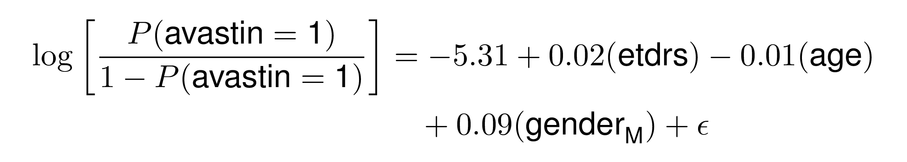
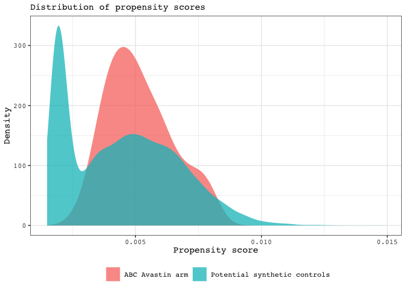
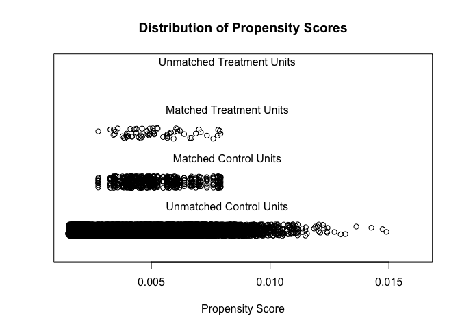

matching\_synthetic\_arm\_to\_abc\_trial
================
Darren S Thomas
07 January, 2020

# Setup

Load packages.

``` r
library(MatchIt)
library(tidymodels)
library(tidyverse)
```

Assign default ggplot theme.

``` r
courier_bw <- theme_bw() +
  theme(text = element_text(family = "Courier"),
        legend.position = "bottom")

theme_set(courier_bw)
```

Read characteristics of abc subjects randomised to Avastin arm.

``` r
abc.arm <- read_csv("data/abc_patient_characteristics.csv",
                    col_types = cols(
                      id = col_character())) %>% 
  mutate(cohort = "abc")
```

Read characteristics of ehr pool whom recieved Eylea.

``` r
ehr.pool <- read_csv("data/ehr_patient_characteristics.csv") %>% 
  mutate(cohort = "ehr")
```

Union ehr and abc tables & then assign a dummy variable as being 1 if
randomised to recieve Avastin and 0 if Eylea recieved.

``` r
abc.ehr <- bind_rows(abc.arm,
                ehr.pool) %>% 
  # create avastin_dummy that is 1 if avastin recieved and 0 if eylea
  mutate(avastin = if_else(treatment == "avastin", 1, 0)) %>% 
  rename(age = age_at_baseline,
         etdrs = baseline_etdrs)
```

# logit propensity scoring

Baseline characteristics were balanced between the ABC and EHR arms on
proensity scores derived from a logistic generalised linear model
regressed on treatment recieved (1 if randomised to recieve Avastin/ 0
if Eylea recieved as per standard healthcare). Baseline characteristics
contributing to the pronensity scores were `baseline_va`,
`age_at_baseline`, `gender` (*AND POTENTIALLY MATCHED FOR OCT THICKNESS
AND PED, IF AVAILABLE*).

``` r
logit <- glm(formula = avastin ~
               etdrs +
               age + 
               gender,
               family = binomial(link = "logit"),
             data = abc.ehr)
```

<!-- -->

Retrive the propensity score for each observation & then plot the
distributions among ABC subjections ramdomsied to recieve Avastin and
potential synthetic controls.

``` r
augment(logit,
        data = abc.ehr,
        type.predict = "response") %>% 
  ggplot(aes(x = .fitted, fill = cohort)) +
  geom_density(alpha = 0.75, size = 0) +
  labs(subtitle = "Distribution of propensity scores",
       x = "Propensity score",
       y = "Density") +
  scale_fill_discrete(name = NULL, labels = c("ABC Avastin arm", "Potential synthetic controls"))
```

<!-- -->

# psm with Matchit packge

``` r
set.seed(1337)

psm <- matchit(formula = avastin ~ etdrs + age + gender,
              data = abc.ehr,
              method = "nearest", # nearest-neighbour matching
              ratio = 10, # specifies 10:1 matching
              replace = FALSE) 
```

``` r
summary(psm)
```

    ## 
    ## Call:
    ## matchit(formula = avastin ~ etdrs + age + gender, data = abc.ehr, 
    ##     method = "nearest", ratio = 10, replace = FALSE)
    ## 
    ## Summary of balance for all data:
    ##          Means Treated Means Control SD Control Mean Diff eQQ Med eQQ Mean
    ## distance        0.0052        0.0044     0.0022    0.0007  0.0008   0.0010
    ## etdrs          51.0469       38.1021    28.1772   12.9448  8.5000  15.9688
    ## age            78.7031       79.9327     8.4369   -1.2296  1.0000   2.3281
    ## genderF         0.5938        0.6183     0.4858   -0.0245  0.0000   0.0156
    ## genderM         0.4062        0.3817     0.4858    0.0245  0.0000   0.0156
    ##          eQQ Max
    ## distance   0.007
    ## etdrs     44.000
    ## age       41.000
    ## genderF    1.000
    ## genderM    1.000
    ## 
    ## 
    ## Summary of balance for matched data:
    ##          Means Treated Means Control SD Control Mean Diff eQQ Med eQQ Mean
    ## distance        0.0052        0.0052     0.0013    0.0000       0   0.0000
    ## etdrs          51.0469       52.3109    12.5025   -1.2641       1   1.9375
    ## age            78.7031       80.2641     7.1396   -1.5609       2   1.7656
    ## genderF         0.5938        0.6422     0.4797   -0.0484       0   0.0469
    ## genderM         0.4062        0.3578     0.4797    0.0484       0   0.0469
    ##          eQQ Max
    ## distance       0
    ## etdrs         25
    ## age           10
    ## genderF        1
    ## genderM        1
    ## 
    ## Percent Balance Improvement:
    ##          Mean Diff.   eQQ Med  eQQ Mean eQQ Max
    ## distance    99.9987   99.8490   99.8473 99.8670
    ## etdrs       90.2350   88.2353   87.8669 43.1818
    ## age        -26.9511 -100.0000   24.1611 75.6098
    ## genderF    -97.6408    0.0000 -200.0000  0.0000
    ## genderM    -97.6408    0.0000 -200.0000  0.0000
    ## 
    ## Sample sizes:
    ##           Control Treated
    ## All         14350      64
    ## Matched       640      64
    ## Unmatched   13710       0
    ## Discarded       0       0

``` r
plot(psm,
     type = "jitter")
```

<!-- -->

    ## [1] "To identify the units, use first mouse button; to stop, use second."

    ## integer(0)

# Analysis

adjust for injection\_count in the analysis.
